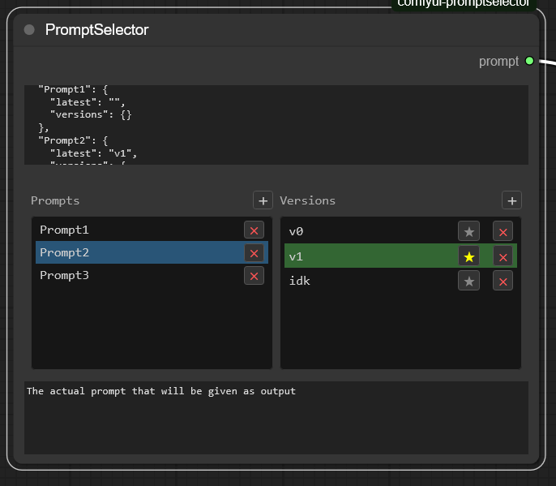

# comfyui-promptselector

ComfyUI custom node for reusing prompts with simple versioning.

## Widgets
- Top input: paste or import a JSON of previous prompts. Auto-updates the selector.
- Selector: 2 columns like a file explorer. Click once to select, click again to rename inline. [+] adds, × deletes, ★ marks latest.
- Prompt: editable preview of the selected version. This is the string that gets passed through.

## Good fits
- VLM captioning and post-refinement
- i2v, i2i, ACE/VACE pipelines
- Style libraries and negative prompt libraries
- A/B tests of phrasings or personas
- Shared conditioning snippets for ControlNet, LoRA, SDXL styles, motion cues